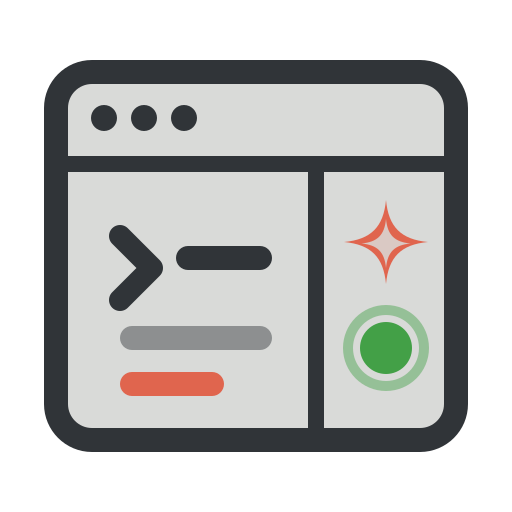

<h1 align="center">
  
  herdr-muse
</h1>

<p align="center">
  <a href="https://github.com/akshat12/herdr-muse/blob/main/LICENSE"></a>
  <a href="https://herdr.dev/docs/install/"></a>
  
</p>

<p align="center">
  Native-feeling <a href="https://herdr.dev">Herdr</a> support for
  <a href="https://dev.meta.ai/docs/muse-code">Muse Code</a> (<code>muse</code>)
  — with <strong>no changes to the Herdr codebase</strong>.<br>
  Herdr shows your <code>muse</code> panes as <code>working</code>,
  <code>idle</code>, or <code>blocked</code> (approval needed) instead of
  <code>unknown</code>.
</p>

This uses Herdr's documented
[custom integration](https://herdr.dev/docs/integrations/) path: Muse lifecycle
hooks report state over the local Herdr socket with source `custom:muse`.

## Install

One command (Herdr 0.8+):

```bash
herdr plugin install akshat12/herdr-muse
```

then run the **Install Muse hooks** action. Or without the plugin system:

```bash
git clone https://github.com/akshat12/herdr-muse && cd herdr-muse && ./install.sh
```

Requirements: `herdr` and `python3` on `PATH`, an existing
`~/.config/muse/` (run `muse` once first). Start a **new** `muse` session
after installing — hooks load at session startup.

> **Compatibility: tested on macOS (Apple Silicon) with Herdr 0.8.2 and
> Muse 1.0.2.** Linux is declared in `herdr-plugin.toml` and the code is
> portable (bash + python3), but it has not been verified there yet —
> reports welcome (see Contributing).

Uninstall anytime: run the **Uninstall Muse hooks** action, or
`./uninstall.sh` (removes only Herdr-owned hook entries and the reporter).

## How it works

`install.sh` copies `hooks/herdr-muse.py` to `~/.config/muse/hooks/` and
registers it for six Muse events (`SessionStart`, `UserPromptSubmit`,
`PreToolUse`, `PermissionRequest`, `Stop`, `SessionEnd`). On each event the
reporter:

1. Finds its Herdr pane by matching its own process ancestry against
   `herdr pane process-info` (shell PID first, foreground PIDs second,
   realpath-compared cwd as fallback) — Muse hooks run with a cleared
   environment, so `HERDR_PANE_ID` is unavailable.
2. Reports `idle` / `working` / `blocked` with the Muse `session_id` via
   `herdr pane report-agent --source custom:muse`, and releases authority on
   `SessionEnd`.

Safety rules: the first `SessionStart` wins per pane; events from unknown
sessions (subagents, background observers) are ignored so child turns can
never flip the lead pane's state; a new session may take over a pane whose
old session left no `muse` foreground process (crash recovery). The reporter
never prints to stdout and exits 0 on every failure path, so it cannot break
the agent.

## Limitations

- Session restore after a Herdr server restart is **not** automatic (Herdr
  only auto-resumes agents it knows how to launch). The Muse session id is
  reported and visible via the Herdr API; resume manually with
  `muse resume <session-id>`.
- `PermissionRequest` hook payload details are extracted defensively; if a
  future Muse version renames fields, the state is still `blocked` but the
  message may degrade to a generic string.
- Hook entry objects must stay minimal — Muse silently skips groups with
  unknown members (found empirically: a `description` field disables the
  group).

## Tests

```bash
./tests/e2e.sh          # synthetic reporter tests (stub herdr binary)
./tests/e2e.sh --live   # + real install, live state transitions in a
                        #   throwaway Herdr pane, uninstall, plugin link
```

Live run transitions a real pane through `unknown → working → done → idle`,
verifies binding release, uninstall cleanliness (settings restored), and
`herdr plugin link` manifest validation.

## Contributing

PRs welcome — this is a community repo with no upstream gatekeeping.

- Fork, branch, open a PR against `main` with a short description of the
  behavior change and how you tested it.
- Run `./tests/e2e.sh` for every change; run `./tests/e2e.sh --live`
  (needs Herdr running) when you touch the reporter, installer, or plugin
  manifest. Keep the suite green.
- Reporter rules that keep this safe to install: no new runtime
  dependencies beyond `python3`, never print to stdout, exit 0 on every
  failure path, and keep hook entries minimal (Muse silently skips hook
  groups with unknown members).
- Hook payload shapes live in `tests/fixtures/` — shapes captured from a
  live session are preferred over guesses; mark anything inferred with an
  `_note` field as `permission_request.json` does.
- Please don't commit machine-specific paths or session ids outside
  `tests/fixtures/`.

## License

MIT — see [LICENSE](LICENSE).
